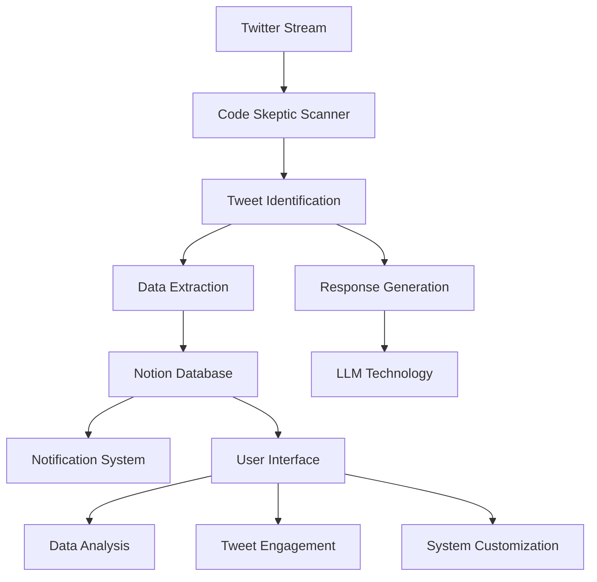
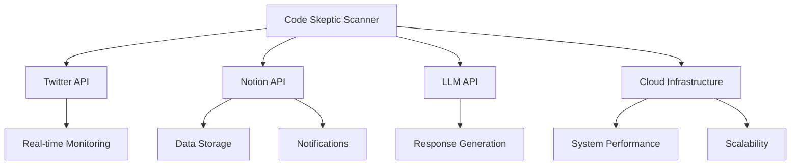
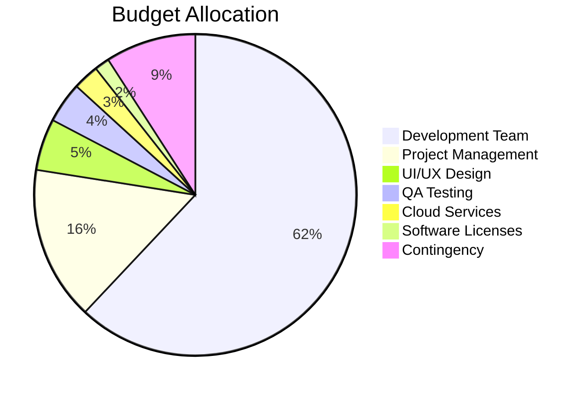
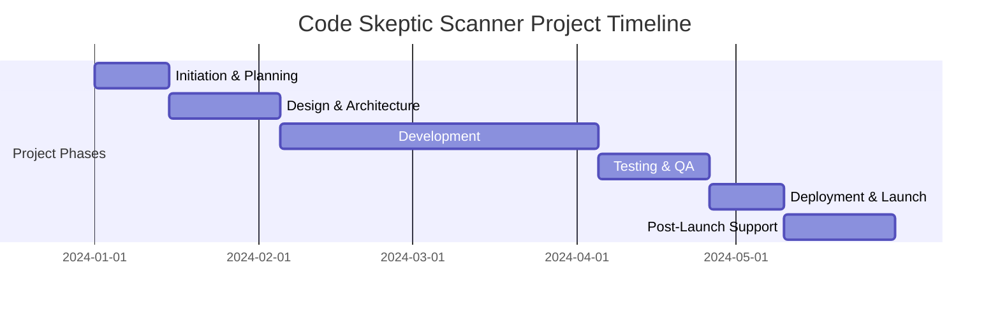
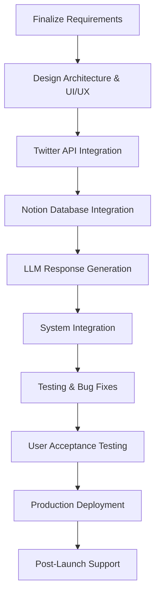
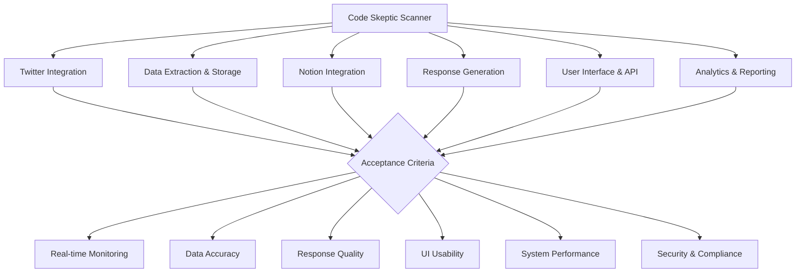

## EXECUTIVE SUMMARY

### PROJECT OVERVIEW

Code Skeptic Scanner is a cutting-edge cloud-based solution designed to monitor, analyze, and respond to skeptical or negative opinions about AI coding tools on Twitter/X in real-time. This innovative system addresses the growing need for companies in the AI development space to stay informed about public sentiment and engage proactively with their audience.

The solution will:
1. Continuously monitor Twitter's streaming API
2. Identify and filter relevant tweets based on customizable criteria
3. Store extracted information in a Notion database
4. Generate AI-powered responses to address concerns and skepticism
5. Provide a user-friendly interface for data analysis and engagement

### OBJECTIVES

1. Real-time monitoring: Capture and analyze relevant tweets as they occur
2. Data aggregation: Collect and organize valuable insights in a centralized Notion database
3. Sentiment analysis: Quantify the level of skepticism or negativity towards AI coding tools
4. Automated response generation: Craft tailored responses using LLM technology
5. User empowerment: Provide a comprehensive UI for data analysis and tweet engagement
6. Trend identification: Enable long-term analysis of public sentiment towards AI coding tools

### VALUE PROPOSITION

Our agency offers a unique combination of expertise and technology to deliver unparalleled value for this project:

1. Seamless integration: Our solution integrates Twitter, Notion, and LLM technologies into a cohesive, powerful tool
2. Customizability: Flexible parameters and prompts allow for fine-tuning to meet specific client needs
3. Scalability: Cloud-based architecture ensures the system can handle high volumes of data
4. Real-time insights: Immediate notifications and updates enable rapid response to emerging trends
5. User-centric design: Intuitive interface prioritizes ease of use and efficiency for team members
6. Compliance focus: Built-in measures to ensure GDPR compliance and adherence to platform terms of service
7. Comprehensive analytics: Tools for both immediate engagement and long-term trend analysis

## PROJECT OBJECTIVES

### BUSINESS GOALS

1. Enhance Brand Reputation: Position the company as a leader in AI technology by actively engaging with and addressing public concerns about AI coding tools.

2. Increase User Adoption: By addressing skepticism and providing informative responses, encourage more developers to try and adopt AI coding tools.

3. Improve Customer Retention: Quickly address concerns and provide support to existing users, reducing churn and improving overall satisfaction.

4. Market Intelligence: Gain valuable insights into public perception, competitor mentions, and emerging trends in the AI coding tool space.

5. Streamline Community Management: Reduce manual effort in monitoring and responding to social media interactions, allowing the team to focus on high-value activities.

### TECHNICAL GOALS

1. Real-time Data Processing: Implement a robust system capable of processing the Twitter stream API in real-time, ensuring no relevant tweets are missed.

2. Seamless Integration: Successfully integrate Twitter API, Notion API, and LLM technology into a cohesive, cloud-based solution.

3. Scalable Architecture: Design a system that can handle increasing volumes of data and user interactions without performance degradation.

4. Advanced Natural Language Processing: Develop accurate sentiment analysis and AI tool mention detection capabilities.

5. Automated Response Generation: Create an LLM-powered system that generates contextually appropriate and helpful responses to skeptical tweets.

6. User-friendly Interface: Develop an intuitive UI that allows easy monitoring, analysis, and engagement with collected data.

7. Data Security and Compliance: Implement robust security measures and ensure full compliance with GDPR and Twitter's terms of service.

### SUCCESS CRITERIA

| Criterion | Target | Measurement Method |
|-----------|--------|---------------------|
| Tweet Capture Rate | >95% | Compare captured tweets to manual sample of relevant tweets |
| Sentiment Analysis Accuracy | >90% | Manual review of a sample set of analyzed tweets |
| Response Generation Speed | <30 seconds | Measure time from tweet capture to response generation |
| User Engagement Rate | >25% increase | Compare engagement metrics before and after system implementation |
| System Uptime | 99.9% | Monitor system availability over time |
| User Satisfaction | >85% positive feedback | Conduct surveys with team members using the system |
| Data Processing Volume | Handle 10,000+ tweets/day | Monitor daily tweet processing statistics |
| Response Quality | >80% approval rate | Manual review of generated responses by the team |
| Time Saved | 20+ hours/week | Compare time spent on manual monitoring before and after implementation |
| Trend Identification | Identify 3+ major trends per month | Review monthly trend reports generated by the system |

```mermaid
graph TD
    A[Code Skeptic Scanner] --> B[Business Goals]
    A --> C[Technical Goals]
    A --> D[Success Criteria]
    B --> E[Enhance Brand Reputation]
    B --> F[Increase User Adoption]
    B --> G[Improve Customer Retention]
    B --> H[Market Intelligence]
    B --> I[Streamline Community Management]
    C --> J[Real-time Data Processing]
    C --> K[Seamless Integration]
    C --> L[Scalable Architecture]
    C --> M[Advanced NLP]
    C --> N[Automated Response Generation]
    C --> O[User-friendly Interface]
    C --> P[Data Security and Compliance]
    D --> Q[Tweet Capture Rate]
    D --> R[Sentiment Analysis Accuracy]
    D --> S[Response Generation Speed]
    D --> T[User Engagement Rate]
    D --> U[System Uptime]
```

## SCOPE OF WORK

### IN-SCOPE

1. Twitter Integration
   - Implement real-time monitoring of Twitter's streaming API
   - Develop filters to identify tweets expressing skepticism or negative opinions about AI coding tools
   - Create a system to check tweets against the specified "popularity threshold"

2. Data Extraction and Storage
   - Extract relevant information from identified tweets (account handle, followers, likes, date/time, content, media, quoted tweets)
   - Implement a Notion database integration for storing extracted data
   - Develop a system to assign a "Doubt Rating" and tag mentioned AI tools

3. Notification System
   - Create a real-time notification system in Notion for new tweet entries

4. AI-Powered Response Generation
   - Develop an LLM-based response generation module
   - Implement customizable prompts and context document integration
   - Ensure generated responses align with @BlitzyAI account tone and messaging

5. User Interface and API
   - Design and develop a user-friendly interface for data analysis and tweet engagement
   - Create an API for system customization and manual controls
   - Integrate the Notion database directly into the UI
   - Implement direct linking to original tweets on Twitter/X

6. System Architecture and Performance
   - Design a scalable, cloud-based architecture to handle high volumes of data
   - Implement robust error handling and logging mechanisms
   - Ensure high availability and real-time performance

7. Analytics and Reporting
   - Develop features for tracking trends in AI coding tool skepticism over time
   - Create customizable reports and dashboards

8. Security and Compliance
   - Implement measures to ensure GDPR compliance
   - Adhere to Twitter's terms of service regarding data collection and storage

### OUT-OF-SCOPE

1. Development of a custom LLM model (will use existing models)
2. Integration with social media platforms other than Twitter/X
3. Automated posting of responses to Twitter (manual approval required)
4. Historical data analysis of tweets prior to system implementation
5. Development of mobile applications (focus on web-based interface)
6. Integration with CRM or marketing automation tools
7. Sentiment analysis of languages other than English
8. Automated content creation for marketing purposes

### ASSUMPTIONS

1. Client will provide necessary Twitter API access and credentials
2. Client has an active Notion workspace and can provide required API access
3. Client will provide access to a suitable LLM API (e.g., OpenAI's GPT-4)
4. Client team members are familiar with Twitter and Notion interfaces
5. Client will provide initial set of custom prompts and context documents for response generation
6. Project will be developed using cloud infrastructure (e.g., AWS, Google Cloud, or Azure)
7. Client will handle any necessary legal reviews or approvals for data collection and storage

### DEPENDENCIES

| Dependency | Description | Potential Impact |
|------------|-------------|-------------------|
| Twitter API | Access and stability of Twitter's streaming API | Could affect real-time monitoring capabilities |
| Notion API | Availability and performance of Notion's API | May impact data storage and notification features |
| LLM API | Access to chosen LLM API (e.g., OpenAI) | Critical for response generation functionality |
| Cloud Services | Reliability of chosen cloud infrastructure | Could affect system performance and availability |
| Third-party Libraries | Updates or changes to key dependencies | May require code adjustments or refactoring |

## BUDGET AND COST ESTIMATES

### COST BREAKDOWN

| Category | Description | Cost (USD) |
|----------|-------------|------------|
| Labor | Development Team (4 developers, 3 months) | $120,000 |
| Labor | Project Manager (1 PM, 3 months) | $30,000 |
| Labor | UI/UX Designer (1 designer, 1 month) | $10,000 |
| Labor | QA Tester (1 tester, 1 month) | $8,000 |
| Infrastructure | Cloud Services (AWS, 3 months) | $5,000 |
| Software Licenses | Development tools and APIs | $3,000 |
| Contingency | 10% of total budget | $17,600 |
| **Total** | | **$193,600** |

### PAYMENT SCHEDULE

| Milestone | Deliverable | Payment (% of Total) | Amount (USD) |
|-----------|-------------|----------------------|--------------|
| Project Kickoff | Signed contract and initial requirements | 20% | $38,720 |
| Design Approval | Approved UI/UX designs and architecture | 20% | $38,720 |
| Alpha Release | Core functionality implemented | 25% | $48,400 |
| Beta Release | Full feature set with initial testing | 25% | $48,400 |
| Project Completion | Final delivery and acceptance | 10% | $19,360 |

### BUDGET CONSIDERATIONS

1. API Usage Fluctuations:
   - The cost of Twitter API and LLM API usage may vary based on actual usage.
   - Mitigation: Implement usage monitoring and alerts to prevent unexpected overages.

2. Cloud Infrastructure Scaling:
   - As the system scales, cloud infrastructure costs may increase.
   - Mitigation: Utilize auto-scaling and implement cost optimization strategies.

3. Extended Development Time:
   - Complex integration challenges may extend the development timeline.
   - Mitigation: Include a time buffer in the schedule and maintain clear communication with stakeholders.

4. Additional Feature Requests:
   - Client may request additional features during development.
   - Mitigation: Implement a change request process with associated cost estimates for any scope changes.

5. Exchange Rate Fluctuations:
   - If using international services or team members, exchange rates may impact costs.
   - Mitigation: Consider using forward contracts or building a small buffer into the budget.

6. Software License Changes:
   - Third-party software or API pricing models may change.
   - Mitigation: Review all license agreements and factor potential increases into the contingency budget.

7. Data Storage Costs:
   - The volume of data stored in Notion may exceed initial estimates.
   - Mitigation: Implement data retention policies and monitor storage usage closely.

This budget and cost estimate provides a comprehensive overview of the expected expenses for the Code Skeptic Scanner project. The payment schedule is designed to align with key project milestones, ensuring a balance between the client's cash flow and the agency's resource allocation. The budget considerations section highlights potential areas of financial uncertainty and provides mitigation strategies to manage these risks effectively.

## TIMELINE AND MILESTONES

### PROJECT TIMELINE

### KEY MILESTONES

| Milestone | Description | Target Date |
|-----------|-------------|-------------|
| Project Kickoff | Initial team meeting, finalize requirements | 2024-01-05 |
| Design Approval | UI/UX designs and system architecture approved | 2024-01-31 |
| Twitter Integration Complete | Real-time monitoring and filtering implemented | 2024-02-23 |
| Notion Database Integration | Data extraction and storage in Notion completed | 2024-03-08 |
| LLM Response Generation | AI-powered response system functional | 2024-03-22 |
| Alpha Release | Core functionality implemented and tested internally | 2024-04-05 |
| Beta Release | Full feature set available for client testing | 2024-04-19 |
| User Acceptance Testing | Client approval of all features and functionality | 2024-04-30 |
| Go-Live | System deployed to production environment | 2024-05-10 |
| Post-Launch Review | Gather feedback and plan future enhancements | 2024-05-31 |

### CRITICAL PATH

The following tasks represent the critical path for the Code Skeptic Scanner project:

1. Finalize project requirements and obtain stakeholder approval
2. Design system architecture and UI/UX
3. Implement Twitter API integration and real-time monitoring
4. Develop Notion database integration for data storage
5. Create LLM-powered response generation module
6. Integrate all components into a cohesive system
7. Conduct thorough testing and bug fixes
8. Perform user acceptance testing with client
9. Deploy to production environment
10. Provide post-launch support and gather feedback

To ensure the project stays on schedule, particular attention should be paid to:

- Early approval of system design and architecture to avoid delays in development
- Timely integration of Twitter API, as this forms the foundation of the system
- Efficient development of the LLM response generation module, which may require multiple iterations
- Thorough testing to identify and resolve any issues before user acceptance testing
- Clear communication with the client during user acceptance testing to quickly address any concerns

By focusing on these critical path elements, we can maintain the project timeline and ensure successful delivery of the Code Skeptic Scanner.

## DELIVERABLES

### LIST OF DELIVERABLES

1. Code Skeptic Scanner Software System
   - Twitter Integration Module
   - Data Extraction and Storage Module
   - Notion Database Integration
   - LLM-powered Response Generation Module
   - User Interface and API
   - Analytics and Reporting Module

2. Documentation
   - System Architecture Document
   - API Documentation
   - User Manual
   - Administrator Guide
   - Data Flow Diagrams

3. Training Materials
   - User Training Guide
   - Video Tutorials
   - Quick Reference Cards

4. Deployment Package
   - Deployment Guide
   - Configuration Files
   - Database Schema

5. Testing Artifacts
   - Test Plan
   - Test Cases
   - Test Results Report

6. Project Management Artifacts
   - Project Plan
   - Status Reports
   - Final Project Report

### DELIVERY SCHEDULE

| Deliverable | Expected Delivery Date |
|-------------|------------------------|
| System Architecture Document | 2024-01-31 |
| Twitter Integration Module | 2024-02-23 |
| Data Extraction and Storage Module | 2024-03-01 |
| Notion Database Integration | 2024-03-08 |
| LLM-powered Response Generation Module | 2024-03-22 |
| User Interface and API (Alpha Version) | 2024-04-05 |
| Analytics and Reporting Module | 2024-04-12 |
| API Documentation | 2024-04-15 |
| Test Plan and Test Cases | 2024-04-15 |
| User Manual (Draft) | 2024-04-19 |
| Administrator Guide (Draft) | 2024-04-19 |
| User Interface and API (Beta Version) | 2024-04-19 |
| Training Materials | 2024-04-26 |
| Deployment Guide | 2024-05-03 |
| Test Results Report | 2024-05-07 |
| Final User Manual and Administrator Guide | 2024-05-10 |
| Deployment Package | 2024-05-10 |
| Final Project Report | 2024-05-31 |

### ACCEPTANCE CRITERIA

1. Code Skeptic Scanner Software System

| Component | Acceptance Criteria |
|-----------|---------------------|
| Twitter Integration | - Successfully captures >95% of relevant tweets - Applies popularity threshold correctly - Handles Twitter API rate limits without data loss |
| Data Extraction & Storage | - Extracts all required fields from tweets with >99% accuracy - Correctly assigns Doubt Rating and AI Tools Mentioned tags |
| Notion Integration | - Stores data in Notion database in real-time - Triggers notifications for new entries - Maintains data consistency between system and Notion |
| Response Generation | - Generates contextually appropriate responses within 30 seconds - Allows customization of prompts and context documents - Achieves >80% approval rate in response quality reviews |
| User Interface & API | - Provides all specified functionality - Achieves >85% user satisfaction in usability tests - API endpoints function as documented |
| Analytics & Reporting | - Generates accurate trend reports - Provides customizable dashboards - Exports data in common formats (CSV, JSON) |

2. Documentation
   - Comprehensive coverage of all system components and features
   - Clear, concise, and free of technical errors
   - Includes all diagrams, screenshots, and examples as necessary
   - Passes review by technical and non-technical stakeholders

3. Training Materials
   - Covers all essential system functions
   - Suitable for users with varying levels of technical expertise
   - Includes hands-on exercises and real-world scenarios
   - Receives positive feedback from a test group of users

4. Deployment Package
   - Successfully deploys system in a test environment
   - Includes all necessary configuration files and instructions
   - Allows for easy updates and rollbacks
   - Passes security audit

5. Testing Artifacts
   - Test plan covers all critical system functions
   - Test cases are comprehensive and reproducible
   - Test results report clearly identifies any issues and their resolutions

6. Project Management Artifacts
   - Accurately reflects project progress and milestones
   - Clearly communicates project status, risks, and mitigation strategies
   - Final report provides comprehensive overview of project outcomes and lessons learned

All deliverables will be subject to client review and approval. Acceptance will be based on meeting the specified criteria and any additional requirements agreed upon during the project. The client will have a 5-business-day review period for each deliverable, during which they can request revisions or clarifications before final acceptance.