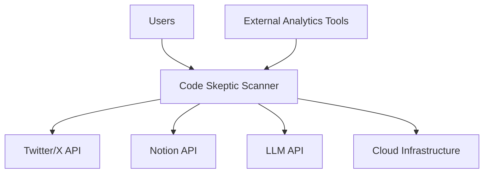
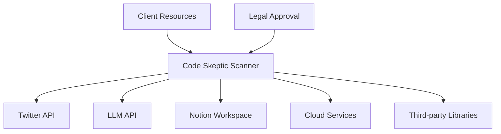
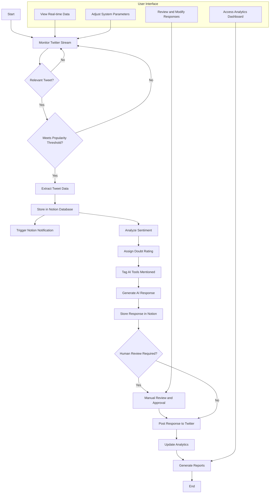
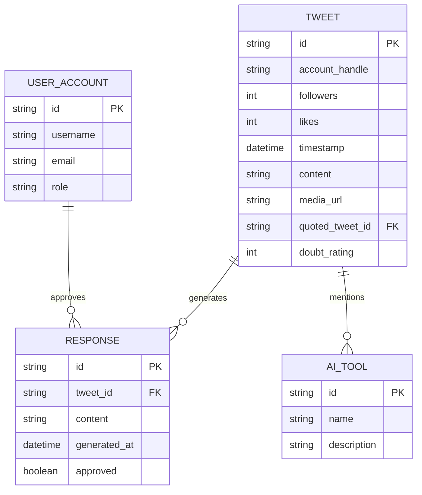
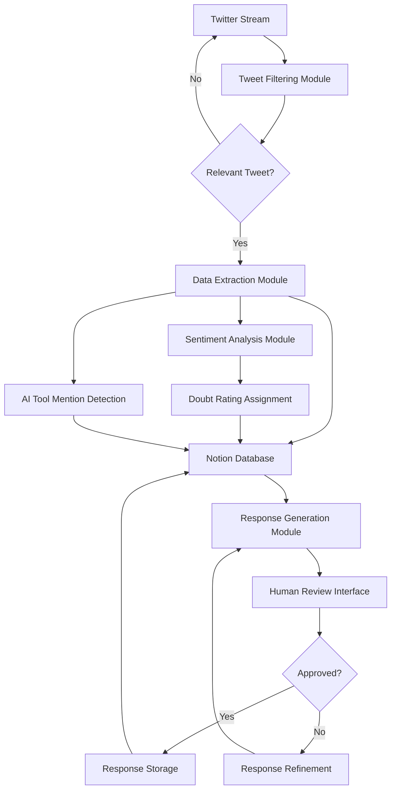
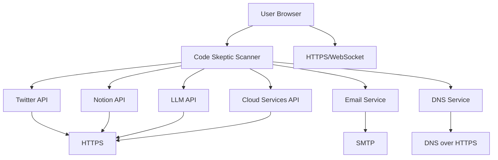

## INTRODUCTION

### PURPOSE

The purpose of this Software Requirements Specification (SRS) document is to provide a comprehensive and detailed description of the Code Skeptic Scanner system. This document serves as the primary reference for the development team, project stakeholders, and quality assurance personnel throughout the software development lifecycle. It aims to:

1. Clearly define the functional and non-functional requirements of the Code Skeptic Scanner.
2. Establish a shared understanding of the system's capabilities and constraints among all project stakeholders.
3. Serve as a basis for project planning, cost estimation, and resource allocation.
4. Provide a benchmark for validating the final product against the initial requirements.

The intended audience for this SRS includes:

- Development Team: To guide the implementation of the system.
- Project Managers: To plan and track project progress.
- Quality Assurance Team: To develop test plans and ensure the system meets specified requirements.
- Client Stakeholders: To review and approve the proposed system functionality.
- Maintenance Team: To understand the system for future updates and support.

### SCOPE

The Code Skeptic Scanner is a cloud-based solution designed to monitor, analyze, and respond to skeptical or negative opinions about AI coding tools on Twitter/X in real-time. This innovative system addresses the growing need for companies in the AI development space to stay informed about public sentiment and engage proactively with their audience.

Key goals and benefits of the Code Skeptic Scanner include:

1. Real-time monitoring of Twitter for relevant discussions about AI coding tools.
2. Automated sentiment analysis and categorization of tweets.
3. Centralized data storage and organization using Notion integration.
4. AI-powered response generation to address concerns and skepticism.
5. Enhanced brand reputation through timely and informed engagement.
6. Improved market intelligence and trend identification in the AI coding tool space.

Core functionalities of the system include:

1. Twitter Integration:
   - Real-time monitoring of Twitter's streaming API.
   - Filtering and identification of relevant tweets based on customizable criteria.
   - Application of popularity thresholds to focus on high-impact conversations.

2. Data Extraction and Storage:
   - Extraction of key information from identified tweets (e.g., account details, content, engagement metrics).
   - Integration with Notion for structured data storage and organization.
   - Assignment of "Doubt Rating" and tagging of mentioned AI tools.

3. Notification System:
   - Real-time Notion notifications for new tweet entries.
   - Customizable alert thresholds and notification preferences.

4. AI-Powered Response Generation:
   - LLM-based module for generating contextually appropriate responses.
   - Customizable prompts and context document integration.
   - Alignment with the @BlitzyAI account tone and messaging.

5. User Interface and API:
   - Intuitive web-based interface for data analysis and tweet engagement.
   - API for system customization and manual controls.
   - Direct integration of Notion database within the UI.
   - Quick access to original tweets on Twitter/X.

6. Analytics and Reporting:
   - Trend tracking and analysis of AI coding tool skepticism over time.
   - Customizable dashboards and report generation.

7. Security and Compliance:
   - Implementation of GDPR compliance measures.
   - Adherence to Twitter's terms of service for data collection and storage.

The Code Skeptic Scanner will be developed using cloud infrastructure (e.g., AWS, Google Cloud, or Azure) to ensure scalability, high availability, and real-time performance. It will integrate with Twitter's API, Notion's API, and a suitable LLM API (e.g., OpenAI's GPT-4) to deliver its core functionalities.

By providing these capabilities, the Code Skeptic Scanner aims to empower AI coding tool companies to effectively monitor public sentiment, engage with their audience, and make data-driven decisions to improve their products and market positioning.

## PRODUCT DESCRIPTION

### PRODUCT PERSPECTIVE

The Code Skeptic Scanner is a standalone cloud-based solution designed to operate within the broader ecosystem of social media monitoring, sentiment analysis, and AI-powered engagement tools. It integrates with existing platforms and services to provide a comprehensive solution for monitoring and responding to skepticism about AI coding tools on Twitter/X.

Key integration points include:

1. Twitter/X Platform: The system interfaces directly with Twitter's streaming API to capture real-time data.

2. Notion: Serves as the primary data storage and organization platform, leveraging Notion's database and notification capabilities.

3. Large Language Model (LLM) API: Utilizes a third-party LLM service (e.g., OpenAI's GPT-4) for advanced natural language processing and response generation.

4. Cloud Infrastructure: Deployed on a scalable cloud platform (e.g., AWS, Google Cloud, or Azure) to ensure high availability and performance.

The Code Skeptic Scanner operates as a central hub, connecting these various components to provide a unified solution for monitoring, analyzing, and responding to AI coding tool skepticism.

### PRODUCT FUNCTIONS

The Code Skeptic Scanner performs the following high-level functions:

1. Real-time Tweet Monitoring: Continuously scans the Twitter stream for relevant discussions about AI coding tools.

2. Sentiment Analysis: Analyzes captured tweets to determine the level of skepticism or negativity towards AI coding tools.

3. Data Extraction and Storage: Extracts relevant information from tweets and stores it in a structured Notion database.

4. Notification System: Alerts team members in real-time when new relevant tweets are identified and processed.

5. AI-Powered Response Generation: Creates contextually appropriate responses to skeptical tweets using LLM technology.

6. User Interface and Data Visualization: Provides an intuitive web-based interface for data analysis, tweet engagement, and system customization.

7. Trend Analysis and Reporting: Generates insights and reports on the overall sentiment and trends related to AI coding tools over time.

8. API for System Customization: Offers programmatic access to adjust system parameters and trigger manual actions.

### USER CHARACTERISTICS

The Code Skeptic Scanner is designed for use by various team members within an AI coding tool company. The primary user groups include:

1. Community Managers
   - Expertise: High proficiency in social media management and community engagement
   - Responsibilities: Monitor incoming tweets, review generated responses, and engage with users
   - Persona: Sarah, a 28-year-old social media expert with 5 years of experience in tech community management

2. Marketing Team Members
   - Expertise: Strong understanding of brand messaging and market trends
   - Responsibilities: Analyze sentiment trends, refine response strategies, and use insights for marketing campaigns
   - Persona: Mark, a 35-year-old marketing manager with a background in product marketing for SaaS companies

3. Product Managers
   - Expertise: Deep knowledge of the AI coding tool product and its features
   - Responsibilities: Use insights to inform product development, address common concerns in product messaging
   - Persona: Priya, a 40-year-old senior product manager with 10+ years of experience in developer tools

4. Data Analysts
   - Expertise: Advanced skills in data analysis and visualization
   - Responsibilities: Create custom reports, identify long-term trends, and provide actionable insights
   - Persona: David, a 31-year-old data scientist with a background in natural language processing

5. System Administrators
   - Expertise: Strong technical skills in cloud infrastructure and API integrations
   - Responsibilities: Manage system configuration, monitor performance, and handle technical issues
   - Persona: Alex, a 37-year-old DevOps engineer with experience in managing large-scale cloud applications

### CONSTRAINTS

1. Twitter API Limitations:
   - Rate limits on API calls may restrict the volume of tweets that can be processed in real-time
   - Changes to Twitter's API policies may require system adjustments

2. Data Privacy Regulations:
   - Must comply with GDPR and other relevant data protection laws
   - Limited in the type and duration of data that can be stored

3. Response Generation Limitations:
   - LLM-generated responses require human review before posting to ensure brand consistency and accuracy
   - The quality of responses is dependent on the capabilities of the chosen LLM API

4. Notion Integration Constraints:
   - Limited by Notion's API capabilities and potential rate limits
   - Database structure must align with Notion's data model

5. Scalability Considerations:
   - System performance may be affected during high-volume events or viral tweets

6. Language Limitations:
   - Initial version focuses on English language tweets only

7. Budget Constraints:
   - Development and operational costs must remain within the allocated budget of $193,600

8. Timeline Restrictions:
   - All development and deployment must be completed within the 5-month project timeline

### ASSUMPTIONS AND DEPENDENCIES

Assumptions:

1. Twitter's streaming API will remain stable and accessible throughout the project development and operation.
2. The selected LLM API will continue to provide the required level of natural language understanding and generation capabilities.
3. Notion will maintain its current feature set and API functionality.
4. The volume of relevant tweets will remain within the estimated range used for system design.
5. Users of the system will have basic familiarity with social media concepts and data analysis tools.
6. The client will provide timely feedback and approvals at key project milestones.

Dependencies:

1. Twitter API Access: Requires approved developer account and API keys from Twitter.
2. LLM API Availability: Depends on the chosen LLM provider (e.g., OpenAI) for continuous service.
3. Notion Workspace: Requires an active Notion workspace with appropriate permissions for database creation and management.
4. Cloud Services: Relies on the selected cloud provider (AWS, Google Cloud, or Azure) for infrastructure and services.
5. Third-party Libraries: Depends on various open-source libraries for development, which must be kept updated and compatible.
6. Client Resources: Requires client team availability for providing domain expertise, custom prompts, and context documents.
7. Legal Approval: Depends on legal team clearance for data collection and storage practices.

This product description provides a comprehensive overview of the Code Skeptic Scanner, its context within the larger ecosystem, main functions, intended users, constraints, and key assumptions and dependencies. It aligns with the previously established technology choices and project parameters, ensuring consistency throughout the Software Requirements Specification (SRS) document.

## PROCESS FLOWCHART

The following flowchart illustrates the high-level process flow of the Code Skeptic Scanner system:

This flowchart represents the main processes of the Code Skeptic Scanner, including:

1. Continuous monitoring of the Twitter stream
2. Identification and filtering of relevant tweets
3. Data extraction and storage in the Notion database
4. Sentiment analysis and tagging
5. AI-powered response generation
6. Human review process (when required)
7. Response posting and analytics updates

The User Interface subgraph shows the main interactions available to users, allowing them to view real-time data, adjust system parameters, review and modify responses, and access the analytics dashboard.

This process flow aligns with the previously established technology choices, including the use of Twitter's API for monitoring, Notion for data storage, and LLM technology for response generation. It also incorporates the human-in-the-loop approach for response approval when necessary, ensuring quality control and brand consistency.

Here's a breakdown of the Code Skeptic Scanner product into features, maintaining consistency with previous technology and framework choices:

1. Twitter Stream Monitoring

ID: F001
DESCRIPTION: Real-time monitoring of Twitter's streaming API to capture tweets expressing skepticism or negative opinions about AI coding tools.
PRIORITY: High

| Requirement ID | Requirement Description |
|----------------|--------------------------|
| F001-1 | Connect to Twitter's streaming API using provided credentials |
| F001-2 | Implement customizable filters to identify relevant tweets |
| F001-3 | Apply popularity threshold based on likes and follower count |
| F001-4 | Handle Twitter API rate limits and connection issues gracefully |
| F001-5 | Log all captured tweets for auditing purposes |

2. Data Extraction and Storage

ID: F002
DESCRIPTION: Extract relevant information from identified tweets and store it in a structured Notion database.
PRIORITY: High

| Requirement ID | Requirement Description |
|----------------|--------------------------|
| F002-1 | Extract specified fields from tweets (account handle, followers, likes, date/time, content, media, quoted tweets) |
| F002-2 | Assign a "Doubt Rating" from 1-10 based on the level of skepticism |
| F002-3 | Identify and tag specific AI tools mentioned in the tweet |
| F002-4 | Store extracted data in a Notion database using Notion's API |
| F002-5 | Ensure data consistency and handle API errors |

3. Notification System

ID: F003
DESCRIPTION: Implement a real-time notification system in Notion for new tweet entries.
PRIORITY: Medium

| Requirement ID | Requirement Description |
|----------------|--------------------------|
| F003-1 | Trigger Notion notifications for each new tweet entry |
| F003-2 | Allow customization of notification settings |
| F003-3 | Provide a summary of new entries in each notification |
| F003-4 | Ensure notifications are delivered in near real-time |

4. AI-Powered Response Generation

ID: F004
DESCRIPTION: Develop an LLM-based module to generate contextually appropriate responses to skeptical tweets.
PRIORITY: High

| Requirement ID | Requirement Description |
|----------------|--------------------------|
| F004-1 | Integrate with chosen LLM API (e.g., OpenAI's GPT-4) |
| F004-2 | Implement customizable prompts and context document integration |
| F004-3 | Generate responses that align with @BlitzyAI account tone and messaging |
| F004-4 | Provide an interface for human review and approval of generated responses |
| F004-5 | Store generated responses in the Notion database |

5. User Interface and API

ID: F005
DESCRIPTION: Create a user-friendly interface for data analysis, tweet engagement, and system customization, along with an API for programmatic access.
PRIORITY: High

| Requirement ID | Requirement Description |
|----------------|--------------------------|
| F005-1 | Develop a web-based UI for monitoring incoming tweets in real-time |
| F005-2 | Integrate Notion database directly into the UI for easy access to collected data |
| F005-3 | Provide direct links to original tweets on Twitter/X |
| F005-4 | Implement controls for adjusting system parameters (e.g., popularity threshold) |
| F005-5 | Create an API for programmatic access to system functions |
| F005-6 | Develop an interface for managing custom prompts and context documents |

6. Analytics and Reporting

ID: F006
DESCRIPTION: Implement features for tracking trends in AI coding tool skepticism and generating customizable reports.
PRIORITY: Medium

| Requirement ID | Requirement Description |
|----------------|--------------------------|
| F006-1 | Develop trend analysis algorithms for sentiment over time |
| F006-2 | Create customizable dashboards for visualizing key metrics |
| F006-3 | Implement report generation functionality with various export options |
| F006-4 | Provide filters and search capabilities for in-depth data analysis |
| F006-5 | Track and display engagement metrics for responses |

7. Security and Compliance

ID: F007
DESCRIPTION: Ensure the system adheres to GDPR requirements and Twitter's terms of service regarding data collection and storage.
PRIORITY: High

| Requirement ID | Requirement Description |
|----------------|--------------------------|
| F007-1 | Implement data encryption for stored tweets and user information |
| F007-2 | Develop data retention and deletion policies in compliance with GDPR |
| F007-3 | Create user authentication and authorization system for accessing the application |
| F007-4 | Implement audit logging for all system actions |
| F007-5 | Ensure compliance with Twitter's terms of service for data usage |

8. System Architecture and Performance

ID: F008
DESCRIPTION: Design and implement a scalable, cloud-based architecture to handle high volumes of data with real-time performance.
PRIORITY: High

| Requirement ID | Requirement Description |
|----------------|--------------------------|
| F008-1 | Develop a microservices-based architecture for scalability |
| F008-2 | Implement load balancing and auto-scaling for cloud resources |
| F008-3 | Optimize database queries and indexing for fast data retrieval |
| F008-4 | Implement caching mechanisms to improve response times |
| F008-5 | Develop a robust error handling and logging system |

This feature breakdown maintains consistency with the previously established technology choices, including the use of Twitter's API, Notion for data storage, LLM technology for response generation, and a cloud-based infrastructure. The features are designed to work together to create a comprehensive system for monitoring, analyzing, and responding to skepticism about AI coding tools on Twitter.

## NON-FUNCTIONAL REQUIREMENTS

### PERFORMANCE

1. Response Time
   - The system shall process and store incoming tweets within 5 seconds of receipt.
   - AI-generated responses shall be produced within 30 seconds of tweet capture.
   - The user interface shall load and display data within 2 seconds of user request.

2. Throughput
   - The system shall be capable of processing a minimum of 1,000 tweets per minute.
   - The Notion database integration shall support writing at least 100 entries per minute.

3. Resource Usage
   - The system shall utilize no more than 80% of allocated cloud resources during peak load.
   - Database queries shall be optimized to execute within 100 milliseconds on average.

### SAFETY

1. Data Backup
   - The system shall perform automated backups of the Notion database daily.
   - Backups shall be stored in a separate geographic region from the primary data.

2. Fault Tolerance
   - The system shall implement automatic failover mechanisms for critical components.
   - In case of Twitter API failure, the system shall queue incoming data for processing once connection is restored.

3. Error Handling
   - The system shall log all errors and exceptions with detailed information for troubleshooting.
   - Critical errors shall trigger immediate notifications to the system administrators.

### SECURITY

1. Authentication
   - The system shall implement multi-factor authentication for all user accounts.
   - User passwords shall be hashed using bcrypt with a minimum work factor of 10.

2. Authorization
   - The system shall enforce role-based access control (RBAC) for all functions.
   - API access shall be controlled using OAuth 2.0 with JWT tokens.

3. Data Encryption
   - All data at rest shall be encrypted using AES-256 encryption.
   - All data in transit shall be protected using TLS 1.3 or higher.

4. Privacy
   - The system shall anonymize or pseudonymize personal data where possible.
   - The system shall provide mechanisms for users to request deletion of their data in compliance with GDPR.

### QUALITY

1. Availability
   - The system shall maintain 99.9% uptime, excluding scheduled maintenance.
   - Scheduled maintenance shall not exceed 4 hours per month and shall be performed during off-peak hours.

2. Maintainability
   - The system shall be designed with modular architecture to facilitate easy updates and modifications.
   - All code shall adhere to established coding standards and be thoroughly documented.

3. Usability
   - The user interface shall be designed to be intuitive, requiring no more than 2 hours of training for new users.
   - The system shall provide contextual help and tooltips for all major functions.

4. Scalability
   - The system shall be designed to scale horizontally to handle up to 10 times the initial load without significant performance degradation.
   - Database sharding shall be implemented to support future growth.

5. Reliability
   - The mean time between failures (MTBF) for the system shall be at least 720 hours.
   - The system shall have a recovery time objective (RTO) of no more than 15 minutes.

### COMPLIANCE

1. GDPR Compliance
   - The system shall implement data protection measures in accordance with GDPR requirements.
   - The system shall provide mechanisms for data subjects to exercise their rights under GDPR.

2. Twitter API Compliance
   - The system shall adhere to all Twitter API terms of service and rate limiting requirements.
   - Data retention policies shall comply with Twitter's developer agreement.

3. Cloud Security Standards
   - The system shall be compliant with SOC 2 Type II standards for cloud security.
   - Regular security audits shall be conducted to ensure ongoing compliance.

4. Accessibility Standards
   - The user interface shall conform to WCAG 2.1 Level AA standards for accessibility.

5. Data Protection
   - The system shall implement measures to comply with relevant data protection laws in the jurisdictions where it operates.

```mermaid
graph TD
    A[Non-Functional Requirements] --> B[Performance]
    A --> C[Safety]
    A --> D[Security]
    A --> E[Quality]
    A --> F[Compliance]
    B --> B1[Response Time]
    B --> B2[Throughput]
    B --> B3[Resource Usage]
    C --> C1[Data Backup]
    C --> C2[Fault Tolerance]
    C --> C3[Error Handling]
    D --> D1[Authentication]
    D --> D2[Authorization]
    D --> D3[Data Encryption]
    D --> D4[Privacy]
    E --> E1[Availability]
    E --> E2[Maintainability]
    E --> E3[Usability]
    E --> E4[Scalability]
    E --> E5[Reliability]
    F --> F1[GDPR Compliance]
    F --> F2[Twitter API Compliance]
    F --> F3[Cloud Security Standards]
    F --> F4[Accessibility Standards]
    F --> F5[Data Protection]
```

These non-functional requirements are designed to ensure that the Code Skeptic Scanner system meets high standards of performance, safety, security, quality, and compliance. They align with the previously established technology choices, including the use of cloud infrastructure, Twitter API integration, Notion database, and LLM technology for response generation. These requirements provide a comprehensive framework for developing a robust, scalable, and compliant system that meets the needs of the project stakeholders.

## DATA REQUIREMENTS

### DATA MODELS

The Code Skeptic Scanner system will primarily handle data related to tweets, user accounts, AI tools, and generated responses. The following entity-relationship diagram illustrates the main entities and their relationships:

### DATA STORAGE

The Code Skeptic Scanner will utilize a combination of Notion databases and cloud-based storage solutions to ensure data integrity, scalability, and compliance with project requirements.

1. Primary Data Storage:
   - Notion Database: Will serve as the primary storage for structured data, including tweet information, AI tool mentions, and generated responses.
   - Cloud Object Storage (e.g., AWS S3): Used for storing media files associated with tweets and any large documents or datasets.

2. Data Retention:
   - Tweet data and responses will be retained for 90 days by default.
   - Historical aggregated data and trends will be retained indefinitely for long-term analysis.
   - Personal data will be subject to GDPR requirements, with mechanisms in place for data deletion upon request.

3. Redundancy and Backup:
   - Notion Database:
     - Utilize Notion's built-in version history and backup features.
     - Implement daily automated exports of the Notion database to cloud storage.
   - Cloud Storage:
     - Enable versioning and cross-region replication for object storage.
     - Implement daily incremental backups and weekly full backups.

4. Recovery:
   - Develop automated recovery scripts to restore data from backups.
   - Implement a disaster recovery plan with a Recovery Time Objective (RTO) of 4 hours and a Recovery Point Objective (RPO) of 1 hour.
   - Regularly test and update the recovery process to ensure its effectiveness.

5. Scalability:
   - Utilize Notion's enterprise plan to handle large volumes of data.
   - Implement data archiving strategies to move older data to lower-cost storage tiers.
   - Use cloud-native scaling features to automatically adjust storage capacity based on demand.

### DATA PROCESSING

The Code Skeptic Scanner will process data from various sources, ensuring security and compliance throughout the data lifecycle.

1. Data Flow:

2. Data Security:

   a. Encryption:
      - All data in transit will be encrypted using TLS 1.3.
      - Data at rest will be encrypted using AES-256 encryption.

   b. Access Control:
      - Implement role-based access control (RBAC) for all system components.
      - Use OAuth 2.0 with JWT tokens for API authentication.
      - Regularly audit and rotate access credentials.

   c. Data Anonymization:
      - Implement data anonymization techniques for non-essential personal information.
      - Use pseudonymization for data required for analysis but not directly linked to individuals.

   d. Secure Data Processing:
      - Process sensitive data in isolated, secure environments.
      - Implement secure multi-party computation for collaborative data analysis when necessary.

   e. Compliance:
      - Ensure all data processing activities comply with GDPR and Twitter's terms of service.
      - Implement data protection impact assessments (DPIA) for high-risk processing activities.
      - Maintain detailed logs of all data processing activities for auditing purposes.

   f. Third-party Integrations:
      - Regularly audit and assess the security practices of third-party services (e.g., LLM API providers).
      - Implement data sharing agreements that ensure compliance with data protection regulations.

   g. Incident Response:
      - Develop and maintain an incident response plan for data breaches or unauthorized access.
      - Conduct regular security drills to test the effectiveness of the incident response plan.

By implementing these data requirements, the Code Skeptic Scanner will ensure efficient, secure, and compliant handling of all data throughout its lifecycle, from initial capture from the Twitter stream to long-term storage and analysis in the Notion database and cloud storage systems.

## EXTERNAL INTERFACES

### USER INTERFACES

The Code Skeptic Scanner will provide a web-based user interface accessible through modern web browsers. The interface will be designed with a focus on usability, efficiency, and responsiveness to accommodate users across various devices.

Key features of the user interface include:

1. Dashboard
   - Real-time display of incoming tweets
   - Overview of key metrics (e.g., tweet volume, sentiment trends)
   - Quick access to recent responses and high-priority items

2. Tweet Analysis View
   - Detailed view of individual tweets with extracted information
   - Sentiment analysis visualization
   - AI tool mention highlighting

3. Response Management
   - Interface for reviewing and approving AI-generated responses
   - Manual response composition and editing tools
   - Response history and performance tracking

4. Settings and Configuration
   - Controls for adjusting system parameters (e.g., popularity threshold)
   - Management of custom prompts and context documents
   - User account and permission settings

5. Analytics and Reporting
   - Interactive charts and graphs for trend analysis
   - Custom report builder
   - Data export functionality

The user interface will adhere to modern web design principles, ensuring responsiveness across desktop and mobile devices. It will also comply with WCAG 2.1 Level AA accessibility standards.

[Placeholder for UI mockups]

### SOFTWARE INTERFACES

The Code Skeptic Scanner will interact with several external software systems and APIs:

1. Twitter API
   - Interface: REST API and Streaming API
   - Purpose: Real-time monitoring of tweets, data retrieval
   - Data Format: JSON
   - Communication Protocol: HTTPS
   - Authentication: OAuth 2.0

2. Notion API
   - Interface: REST API
   - Purpose: Data storage, retrieval, and notification management
   - Data Format: JSON
   - Communication Protocol: HTTPS
   - Authentication: API Key

3. LLM API (e.g., OpenAI GPT-4)
   - Interface: REST API
   - Purpose: Generation of responses to tweets
   - Data Format: JSON
   - Communication Protocol: HTTPS
   - Authentication: API Key

4. Cloud Services API (e.g., AWS, Google Cloud, or Azure)
   - Interface: REST API
   - Purpose: Infrastructure management, scaling, and monitoring
   - Data Format: JSON
   - Communication Protocol: HTTPS
   - Authentication: IAM or equivalent

### COMMUNICATION INTERFACES

The Code Skeptic Scanner will utilize the following communication interfaces:

1. HTTPS
   - Purpose: Secure communication for all external API interactions and user interface access
   - Protocol: TLS 1.3 or higher
   - Port: 443

2. WebSocket
   - Purpose: Real-time updates for the user interface
   - Protocol: WSS (WebSocket Secure)
   - Port: 443

3. SMTP
   - Purpose: Sending email notifications for critical alerts and reports
   - Protocol: SMTP with TLS
   - Port: 587 (or as configured by the email service provider)

4. DNS
   - Purpose: Domain name resolution for the web application and API endpoints
   - Protocol: DNS over HTTPS (DoH) for enhanced security
   - Port: 443

Data Formats:
- JSON: Primary data format for API communications and data storage
- CSV: Optional format for data exports and report generation
- HTML/CSS/JavaScript: For rendering the web-based user interface

Interaction Methods:
- RESTful API calls for most service-to-service communications
- Server-Sent Events (SSE) for pushing real-time updates to the client
- WebSocket connections for bi-directional real-time communication where necessary

This diagram illustrates the various external interfaces and communication protocols used by the Code Skeptic Scanner system. All external communications are secured using appropriate encryption and authentication methods to ensure data privacy and system security.

## APPENDICES

### GLOSSARY

- Doubt Rating: A numerical score from 1-10 assigned to tweets, indicating the level of skepticism or negativity towards AI coding tools.
- Popularity Threshold: A configurable metric based on the number of likes and/or follower count used to determine which tweets are processed by the system.
- Context Document: Additional information provided to the LLM to guide response generation, ensuring alignment with company messaging and tone.
- Quoted Tweet: A tweet that is shared by another user with added commentary.

### ACRONYMS

- API: Application Programming Interface
- AWS: Amazon Web Services
- CSV: Comma-Separated Values
- GDPR: General Data Protection Regulation
- IAM: Identity and Access Management
- JSON: JavaScript Object Notation
- JWT: JSON Web Token
- LLM: Large Language Model
- NLP: Natural Language Processing
- OAuth: Open Authorization
- RBAC: Role-Based Access Control
- REST: Representational State Transfer
- RTO: Recovery Time Objective
- RPO: Recovery Point Objective
- SRS: Software Requirements Specification
- SSE: Server-Sent Events
- TLS: Transport Layer Security
- UI: User Interface
- UX: User Experience
- WCAG: Web Content Accessibility Guidelines
- WSS: WebSocket Secure

### ADDITIONAL REFERENCES

1. Twitter Developer Documentation: https://developer.twitter.com/en/docs
2. Notion API Documentation: https://developers.notion.com/
3. OpenAI API Documentation: https://platform.openai.com/docs/
4. AWS Documentation: https://docs.aws.amazon.com/
5. GDPR Official Text: https://gdpr-info.eu/
6. WCAG 2.1 Guidelines: https://www.w3.org/TR/WCAG21/
7. OAuth 2.0 Specification: https://oauth.net/2/
8. JSON Web Token (JWT) Specification: https://tools.ietf.org/html/rfc7519
9. WebSocket Protocol: https://tools.ietf.org/html/rfc6455
10. Server-Sent Events Specification: https://html.spec.whatwg.org/multipage/server-sent-events.html

These additional references provide in-depth information on the technologies, standards, and protocols used in the development of the Code Skeptic Scanner. They serve as valuable resources for the development team, system administrators, and any stakeholders seeking a deeper understanding of the system's components and compliance requirements.