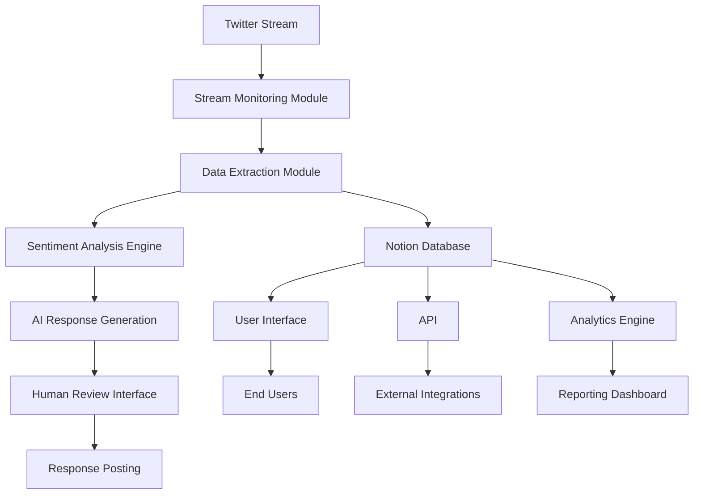
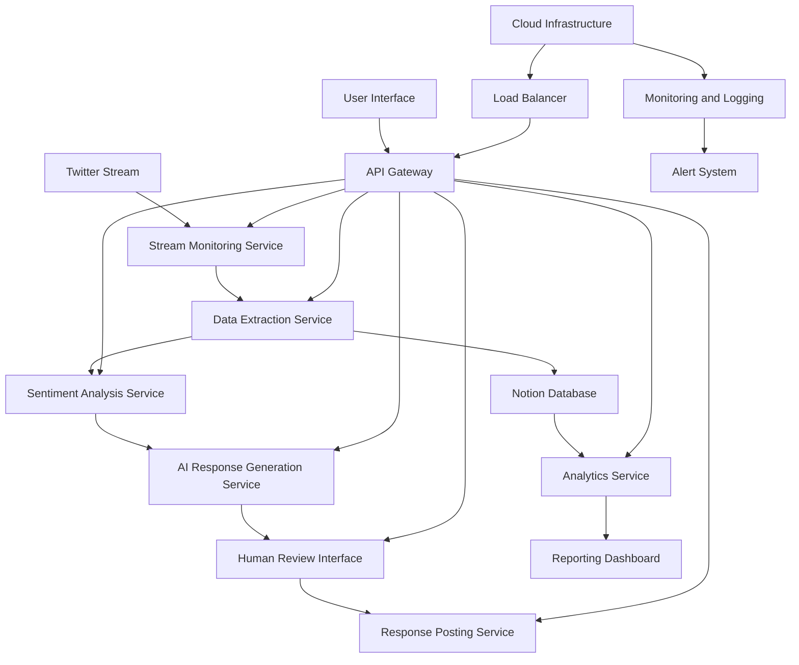
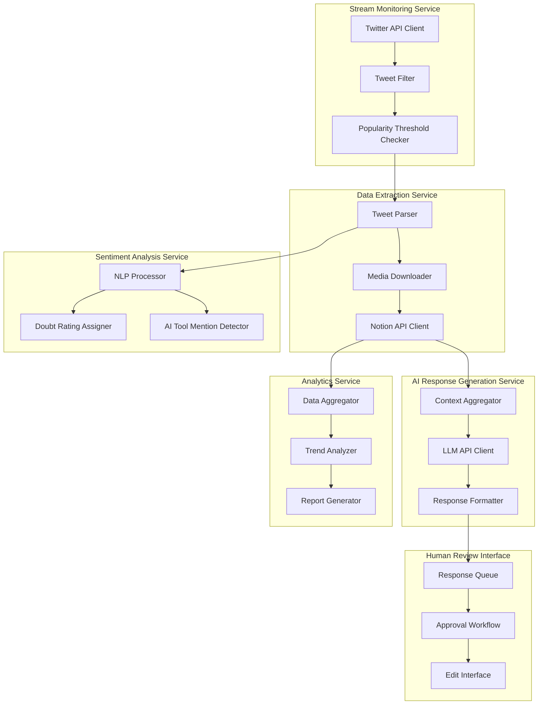
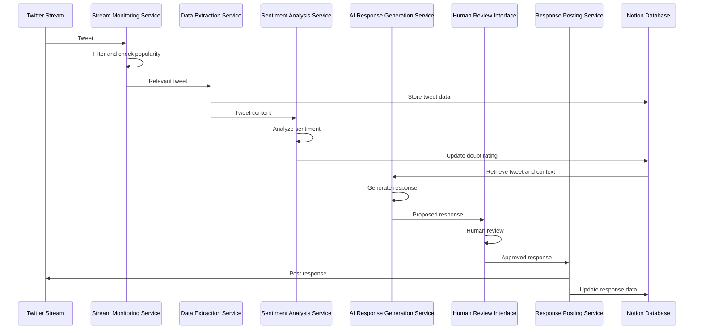
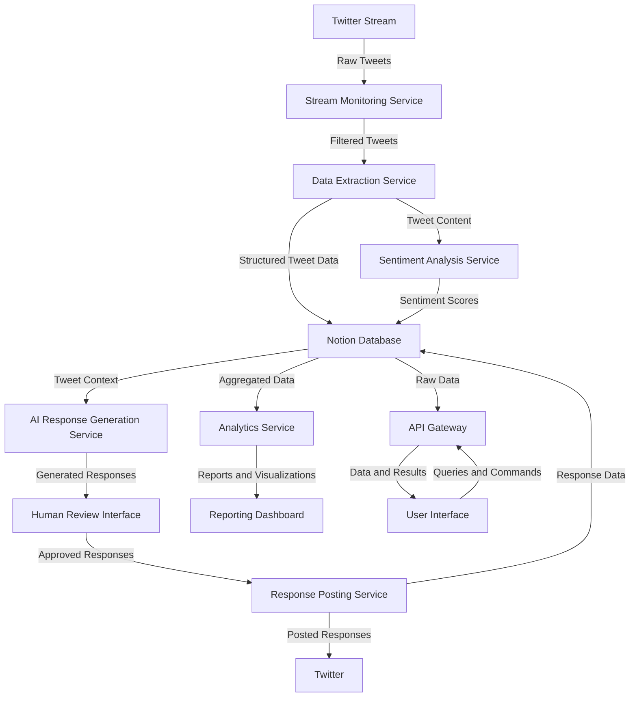
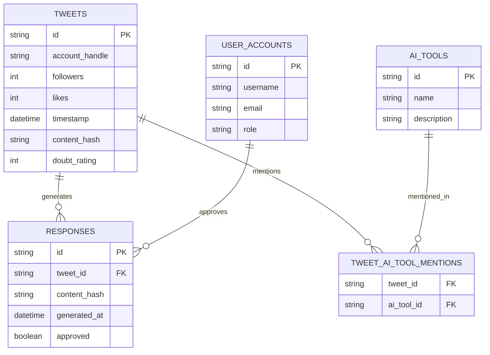
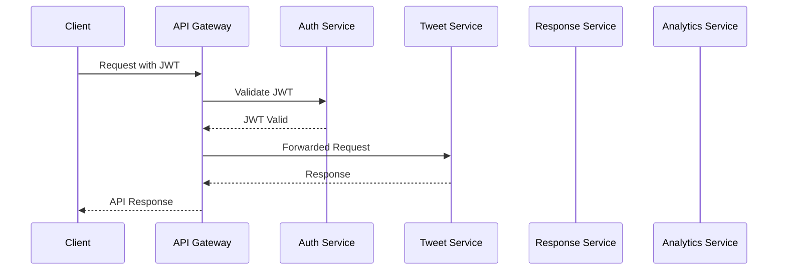
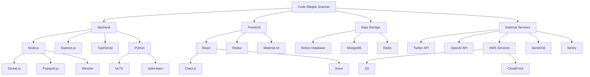
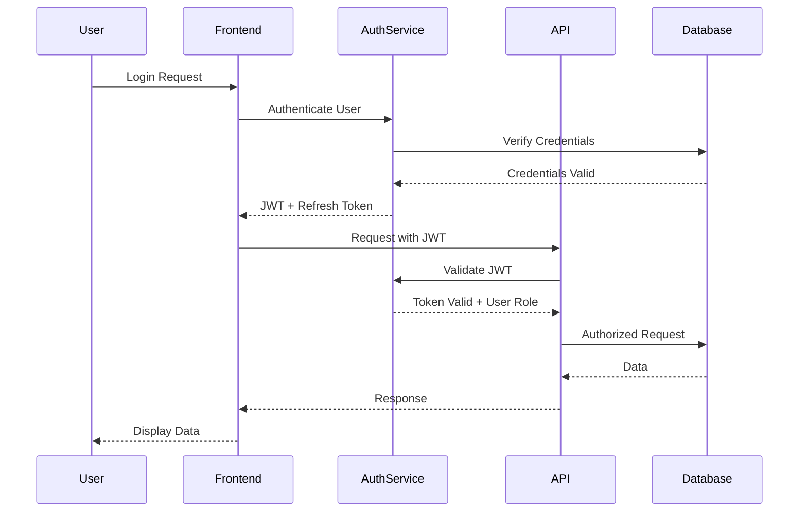

## INTRODUCTION

### SYSTEM OVERVIEW

The Code Skeptic Scanner is a comprehensive cloud-based solution designed to monitor, analyze, and respond to skeptical or negative opinions about AI coding tools on Twitter/X in real-time. This innovative system addresses the growing need for companies in the AI development space to stay informed about public sentiment and engage proactively with their audience.

Key components of the system include:

1. Twitter Stream Monitoring Module
2. Data Extraction and Storage System
3. Sentiment Analysis Engine
4. AI-Powered Response Generation Module
5. User Interface and API
6. Analytics and Reporting Engine

The system architecture is designed to be scalable, resilient, and compliant with data protection regulations. It leverages cloud infrastructure to ensure high availability and real-time performance.



The system operates as follows:

1. The Stream Monitoring Module continuously scans the Twitter API for relevant tweets based on customizable criteria.
2. Identified tweets are processed by the Data Extraction Module, which extracts key information and stores it in the Notion database.
3. The Sentiment Analysis Engine analyzes the tweet content to determine the level of skepticism or negativity.
4. For tweets meeting certain thresholds, the AI Response Generation Module creates contextually appropriate responses using LLM technology (e.g., GPT-4).
5. Generated responses are reviewed through the Human Review Interface before being posted back to Twitter.
6. All data is accessible through the User Interface and API, allowing for real-time monitoring, analysis, and system configuration.
7. The Analytics Engine processes the collected data to generate insights and trends, viewable through the Reporting Dashboard.

This system architecture ensures a seamless flow of data from initial tweet capture to response generation and analytics, providing a comprehensive tool for monitoring and engaging with AI coding tool skepticism on Twitter.

Key technologies and frameworks used in the system include:

- Cloud Infrastructure: AWS, Google Cloud, or Azure
- Database: Notion API for primary data storage
- Language Model: OpenAI's GPT-4 or equivalent for response generation
- Backend: Node.js with Express.js
- Frontend: React.js for the user interface
- API: RESTful architecture with OAuth 2.0 authentication
- Real-time Communication: WebSockets for live updates
- Data Processing: Apache Spark for large-scale data analysis
- Monitoring and Logging: ELK stack (Elasticsearch, Logstash, Kibana)

The Code Skeptic Scanner is designed to be highly configurable, allowing users to adjust parameters such as popularity thresholds, sentiment analysis sensitivity, and response generation guidelines. This flexibility ensures that the system can adapt to changing needs and market conditions.

By providing these capabilities, the Code Skeptic Scanner empowers AI coding tool companies to effectively monitor public sentiment, engage with their audience, and make data-driven decisions to improve their products and market positioning.

## SYSTEM ARCHITECTURE

### PROGRAMMING LANGUAGES

The Code Skeptic Scanner will utilize the following programming languages, chosen for their suitability to the project requirements, ecosystem support, and team expertise:

| Language | Purpose | Justification |
|----------|---------|---------------|
| JavaScript (Node.js) | Backend development | - Excellent for real-time applications<br>- Rich ecosystem of libraries<br>- Asynchronous nature suits API-heavy operations<br>- Consistent language across frontend and backend |
| TypeScript | Backend type safety | - Adds static typing to JavaScript<br>- Improves code maintainability and reduces runtime errors<br>- Enhances developer productivity with better tooling support |
| React (JavaScript) | Frontend development | - Component-based architecture for reusable UI elements<br>- Virtual DOM for efficient updates<br>- Large community and ecosystem<br>- Seamless integration with Node.js backend |
| Python | Data processing and analysis | - Excellent for data manipulation and analysis<br>- Rich libraries for NLP and machine learning (e.g., NLTK, scikit-learn)<br>- Easy integration with cloud services and APIs |
| SQL | Database queries | - Standard language for relational database operations<br>- Used for complex queries and data analysis within the cloud database |

### HIGH-LEVEL ARCHITECTURE DIAGRAM

The following diagram provides an overview of the Code Skeptic Scanner's high-level architecture:



### COMPONENT DIAGRAMS

The following diagram details the specific components within the Code Skeptic Scanner:



### SEQUENCE DIAGRAMS

The following sequence diagram illustrates the process of capturing and responding to a relevant tweet:



### DATA-FLOW DIAGRAM

The following diagram illustrates how information moves through the Code Skeptic Scanner system:



This data-flow diagram shows how information is processed from the initial capture of tweets through to the generation of responses and analytics. The Notion Database serves as the central data store, with various services interacting with it to read and write data. The API Gateway acts as the interface between the user interface and the backend services, ensuring secure and controlled access to the system's functionality.

## SYSTEM DESIGN

### PROGRAMMING LANGUAGES

The Code Skeptic Scanner will utilize the following programming languages, chosen for their suitability to the project requirements, ecosystem support, and team expertise:

| Language | Purpose | Justification |
|----------|---------|---------------|
| JavaScript (Node.js) | Backend development | - Excellent for real-time applications<br>- Rich ecosystem of libraries<br>- Asynchronous nature suits API-heavy operations<br>- Consistent language across frontend and backend |
| TypeScript | Backend type safety | - Adds static typing to JavaScript<br>- Improves code maintainability and reduces runtime errors<br>- Enhances developer productivity with better tooling support |
| React (JavaScript) | Frontend development | - Component-based architecture for reusable UI elements<br>- Virtual DOM for efficient updates<br>- Large community and ecosystem<br>- Seamless integration with Node.js backend |
| Python | Data processing and analysis | - Excellent for data manipulation and analysis<br>- Rich libraries for NLP and machine learning (e.g., NLTK, scikit-learn)<br>- Easy integration with cloud services and APIs |
| SQL | Database queries | - Standard language for relational database operations<br>- Used for complex queries and data analysis within the cloud database |

### DATABASE DESIGN

The Code Skeptic Scanner will primarily use Notion as its database, leveraging its flexible structure and API capabilities. However, we will also utilize a cloud-based relational database for certain performance-critical operations and data that requires more structured storage.

Notion Database Structure:

1. Tweets Table
   - Properties: ID (Primary Key), Account Handle, Followers, Likes, Date and Time, Tweet Content, Media URL, Quoted Tweet ID, Doubt Rating, AI Tools Mentioned

2. Responses Table
   - Properties: ID (Primary Key), Tweet ID (Foreign Key), Response Content, Generated At, Approved Status

3. AI Tools Table
   - Properties: ID (Primary Key), Tool Name, Description

4. Custom Prompts Table
   - Properties: ID (Primary Key), Prompt Name, Prompt Content, Created At, Last Used

Cloud Relational Database (e.g., PostgreSQL on AWS RDS):



This hybrid approach allows us to leverage Notion's flexibility for most operations while using a relational database for performance-critical queries and data integrity constraints.

### API DESIGN

The Code Skeptic Scanner will expose a RESTful API for internal communication between services and for external integrations. The API will be designed following OpenAPI (Swagger) specifications.

Key API endpoints:

1. Tweet Management
   - GET /tweets: Retrieve tweets based on filters
   - POST /tweets: Add a new tweet to the system
   - GET /tweets/{id}: Retrieve a specific tweet
   - PUT /tweets/{id}: Update tweet information

2. Response Management
   - GET /responses: Retrieve responses based on filters
   - POST /responses: Generate a new response
   - PUT /responses/{id}: Update a response (e.g., approve/reject)

3. AI Tool Management
   - GET /ai-tools: Retrieve list of AI tools
   - POST /ai-tools: Add a new AI tool
   - PUT /ai-tools/{id}: Update AI tool information

4. Analytics
   - GET /analytics/sentiment: Retrieve sentiment trends
   - GET /analytics/engagement: Retrieve engagement metrics

5. System Configuration
   - GET /config: Retrieve current system configuration
   - PUT /config: Update system configuration (e.g., popularity threshold)

API Authentication and Security:
- OAuth 2.0 for authentication
- JWT for session management
- Rate limiting to prevent abuse
- HTTPS encryption for all communications



### USER INTERFACE DESIGN

The Code Skeptic Scanner will feature a web-based user interface built with React, focusing on usability, responsiveness, and real-time updates.

Key UI components:

1. Dashboard
   ```
   +----------------------------------+
   |  Header (Logo, User Menu)        |
   +----------------------------------+
   | Sidebar | Main Content Area      |
   | - Menus | +--------------------+ |
   | - Filters| | Real-time Tweet    | |
   |         | | Stream             | |
   |         | +--------------------+ |
   |         | +--------------------+ |
   |         | | Key Metrics        | |
   |         | | - Sentiment Trend  | |
   |         | | - Response Rate    | |
   |         | +--------------------+ |
   +----------------------------------+
   ```

2. Tweet Analysis View
   ```
   +----------------------------------+
   | Tweet Content                    |
   | - Account Info                   |
   | - Engagement Metrics             |
   +----------------------------------+
   | Sentiment Analysis               |
   | [----------X---] Doubt Rating: 7 |
   +----------------------------------+
   | AI Tools Mentioned               |
   | [Tool 1] [Tool 2] [Tool 3]       |
   +----------------------------------+
   | Generated Response               |
   | [Response Text]                  |
   | [Approve] [Reject] [Edit]        |
   +----------------------------------+
   ```

3. Analytics Dashboard
   ```
   +----------------------------------+
   | Date Range Selector              |
   +----------------------------------+
   | +----------------+ +------------+|
   | | Sentiment Trend| |Tool Mention||
   | | [Line Chart]   | | [Pie Chart]||
   | +----------------+ +------------+|
   | +----------------+ +------------+|
   | | Response Rate  | |Engagement  ||
   | | [Bar Chart]    | | [Heatmap]  ||
   | +----------------+ +------------+|
   +----------------------------------+
   ```

4. Configuration Panel
   ```
   +----------------------------------+
   | System Parameters                |
   | Popularity Threshold: [____]     |
   | Doubt Rating Sensitivity: [____] |
   +----------------------------------+
   | Custom Prompts                   |
   | [List of Prompts]                |
   | [Add New Prompt]                 |
   +----------------------------------+
   | AI Tool Management               |
   | [List of AI Tools]               |
   | [Add New Tool]                   |
   +----------------------------------+
   ```

The UI will be implemented using React components, with Redux for state management and Material-UI for consistent styling. Real-time updates will be achieved using WebSocket connections, ensuring that users always see the most current data without needing to refresh the page.

Accessibility will be a key focus, with the UI adhering to WCAG 2.1 Level AA standards. This includes proper contrast ratios, keyboard navigation support, and screen reader compatibility.

The responsive design will ensure that the interface is usable on various devices, from desktop computers to tablets and smartphones, adapting the layout and functionality as needed for different screen sizes.

This system design section outlines the key technical decisions and structures for the Code Skeptic Scanner, maintaining consistency with the previously established technology choices and project requirements. It provides a solid foundation for the development team to begin implementation while ensuring scalability, performance, and user-friendliness.

## TECHNOLOGY STACK

### PROGRAMMING LANGUAGES

The Code Skeptic Scanner will utilize the following programming languages:

| Language | Purpose | Justification |
|----------|---------|---------------|
| JavaScript (Node.js) | Backend development | - Excellent for real-time applications<br>- Rich ecosystem of libraries<br>- Asynchronous nature suits API-heavy operations<br>- Consistent language across frontend and backend |
| TypeScript | Type-safe backend development | - Adds static typing to JavaScript<br>- Improves code maintainability and reduces runtime errors<br>- Enhances developer productivity with better tooling support |
| Python | Data processing and NLP tasks | - Robust libraries for data analysis and NLP (e.g., NLTK, scikit-learn)<br>- Efficient for prototyping and implementing machine learning models<br>- Easy integration with cloud services |
| React (JavaScript) | Frontend development | - Component-based architecture for reusable UI elements<br>- Virtual DOM for efficient updates<br>- Large community and ecosystem<br>- Seamless integration with Node.js backend |

### FRAMEWORKS AND LIBRARIES

The following frameworks and libraries will be utilized in the development of the Code Skeptic Scanner:

| Framework/Library | Purpose |
|-------------------|---------|
| Express.js | Web application framework for Node.js backend |
| React | Frontend UI development |
| Redux | State management for React applications |
| Jest | JavaScript testing framework |
| Axios | HTTP client for API requests |
| Socket.io | Real-time, bidirectional communication |
| Passport.js | Authentication middleware for Node.js |
| Winston | Logging library for Node.js |
| NLTK | Natural Language Toolkit for Python NLP tasks |
| scikit-learn | Machine learning library for Python |
| Material-UI | React component library for consistent UI design |
| Chart.js | JavaScript charting library for data visualization |

### DATABASES

The Code Skeptic Scanner will employ the following database systems:

| Database | Purpose | Justification |
|----------|---------|---------------|
| Notion Database | Primary data storage | - Integration with existing Notion workspace<br>- Flexible schema for storing diverse data types<br>- Built-in version history and collaboration features |
| MongoDB | High-performance data storage | - Scalable NoSQL database for handling large volumes of unstructured data<br>- Flexible schema for evolving data models<br>- Excellent performance for read-heavy operations |
| Redis | Caching and real-time data | - In-memory data structure store for high-speed data access<br>- Pub/Sub capabilities for real-time features<br>- Reduces load on primary databases |

### THIRD-PARTY SERVICES

The following external services and APIs will be integrated into the Code Skeptic Scanner:

| Service | Purpose |
|---------|---------|
| Twitter API | Real-time tweet monitoring and data retrieval |
| Notion API | Integration with Notion database for data storage and retrieval |
| OpenAI API (GPT-4) | Natural language processing and response generation |
| AWS S3 | Cloud storage for media files and backups |
| AWS CloudFront | Content delivery network for improved global performance |
| SendGrid | Email delivery service for notifications and alerts |
| Sentry | Error tracking and performance monitoring |
| GitHub Actions | Continuous Integration and Deployment (CI/CD) |

### TECHNOLOGY STACK DIAGRAM



This technology stack diagram provides a visual representation of the various components and their relationships within the Code Skeptic Scanner system. It illustrates how the backend, frontend, data storage, and external services are interconnected, showcasing the comprehensive and robust nature of the chosen technology stack.

## SECURITY CONSIDERATIONS

### AUTHENTICATION AND AUTHORIZATION

The Code Skeptic Scanner will implement a robust authentication and authorization system to ensure secure access to the application and its features.

1. Authentication:
   - Multi-factor authentication (MFA) will be mandatory for all user accounts.
   - OAuth 2.0 with OpenID Connect will be used for authentication, supporting social login options (e.g., Google, GitHub) as well as email/password.
   - Passwords will be hashed using bcrypt with a minimum work factor of 12.
   - JWT (JSON Web Tokens) will be used for maintaining user sessions, with a short expiration time (15 minutes) and secure refresh token mechanism.

2. Authorization:
   - Role-Based Access Control (RBAC) will be implemented to manage user permissions.
   - The following roles will be defined:

| Role | Description | Permissions |
|------|-------------|-------------|
| Admin | System administrator | Full access to all features and configuration settings |
| Manager | Team lead or project manager | Access to all data and response management features, limited configuration access |
| Analyst | Data analyst or researcher | Read access to all data, ability to generate reports and analyze trends |
| Responder | Community manager or support staff | Ability to review and post responses, limited data access |
| Viewer | Stakeholder or read-only user | Read-only access to dashboards and reports |

3. API Security:
   - API access will be secured using OAuth 2.0 client credentials flow for service-to-service communication.
   - Rate limiting will be implemented to prevent abuse of API endpoints.
   - API keys will be used for external integrations, with the ability to revoke or rotate keys as needed.



### DATA SECURITY

The Code Skeptic Scanner will implement comprehensive data security measures to protect sensitive information throughout its lifecycle.

1. Data Encryption:
   - All data at rest will be encrypted using AES-256 encryption.
   - Data in transit will be protected using TLS 1.3 or higher.
   - Database encryption will be enabled for the Notion database and any additional cloud databases used.

2. Data Classification:
   - A data classification system will be implemented to categorize information based on sensitivity:

| Classification | Description | Examples | Security Measures |
|----------------|-------------|----------|-------------------|
| Public | Non-sensitive, publicly available | Published tweets, public user profiles | No additional measures |
| Internal | Not for public, but not sensitive | Aggregated analytics, non-personal trends | Access control, encryption at rest |
| Confidential | Sensitive business data | Custom prompts, response strategies | Strong access control, encryption, audit logging |
| Restricted | Highly sensitive, personal data | User account details, unpublished responses | Strict access control, encryption, anonymization where possible |

3. Data Anonymization and Pseudonymization:
   - Personal data will be anonymized or pseudonymized where possible, especially for analytics and reporting purposes.
   - Data minimization principles will be applied to collect and store only necessary information.

4. Secure Data Deletion:
   - A data retention policy will be implemented, automatically deleting or archiving data after a specified period.
   - Secure data deletion methods will be used when removing data from storage systems.

5. Data Access Logging:
   - All access to sensitive data will be logged, including user ID, timestamp, and action performed.
   - Regular audits of data access logs will be conducted to detect any unusual patterns or potential security breaches.

### SECURITY PROTOCOLS

The Code Skeptic Scanner will adhere to industry-standard security protocols and best practices to maintain a robust security posture.

1. Network Security:
   - Implement a Web Application Firewall (WAF) to protect against common web vulnerabilities.
   - Use Virtual Private Cloud (VPC) to isolate and secure cloud resources.
   - Implement network segmentation to separate different components of the application.

2. Vulnerability Management:
   - Conduct regular vulnerability scans and penetration testing.
   - Implement a bug bounty program to encourage responsible disclosure of security issues.
   - Maintain an up-to-date inventory of all software components and dependencies.

3. Secure Development Lifecycle:
   - Follow OWASP (Open Web Application Security Project) guidelines for secure coding practices.
   - Implement automated security testing as part of the CI/CD pipeline.
   - Conduct regular code reviews with a focus on security.

4. Incident Response:
   - Develop and maintain an incident response plan.
   - Conduct regular security drills to test the effectiveness of the incident response plan.
   - Implement automated alerting for potential security incidents.

5. Compliance:
   - Ensure compliance with relevant data protection regulations (e.g., GDPR, CCPA).
   - Conduct regular security audits and maintain documentation for compliance purposes.
   - Implement privacy by design principles throughout the application.

6. Third-Party Security:
   - Conduct security assessments of all third-party integrations and APIs.
   - Implement secure methods for sharing data with third-party services.
   - Regularly review and update security agreements with vendors and service providers.

7. Monitoring and Logging:
   - Implement centralized logging for all system components.
   - Use Security Information and Event Management (SIEM) tools for real-time security monitoring.
   - Set up alerts for suspicious activities or potential security breaches.

```mermaid
graph TD
    A[Security Protocols] --> B[Network Security]
    A --> C[Vulnerability Management]
    A --> D[Secure Development]
    A --> E[Incident Response]
    A --> F[Compliance]
    A --> G[Third-Party Security]
    A --> H[Monitoring and Logging]

    B --> B1[WAF]
    B --> B2[VPC]
    B --> B3[Segmentation]

    C --> C1[Scans]
    C --> C2[Bug Bounty]
    C --> C3[Inventory]

    D --> D1[OWASP Guidelines]
    D --> D2[Automated Testing]
    D --> D3[Code Reviews]

    E --> E1[Response Plan]
    E --> E2[Security Drills]
    E --> E3[Automated Alerts]

    F --> F1[GDPR/CCPA]
    F --> F2[Audits]
    F --> F3[Privacy by Design]

    G --> G1[Assessments]
    G --> G2[Secure Sharing]
    G --> G3[Vendor Reviews]

    H --> H1[Centralized Logging]
    H --> H2[SIEM]
    H --> H3[Alerts]
```



These security considerations provide a comprehensive framework for ensuring the confidentiality, integrity, and availability of the Code Skeptic Scanner system. By implementing these measures, the system will maintain a strong security posture while complying with relevant regulations and industry best practices.